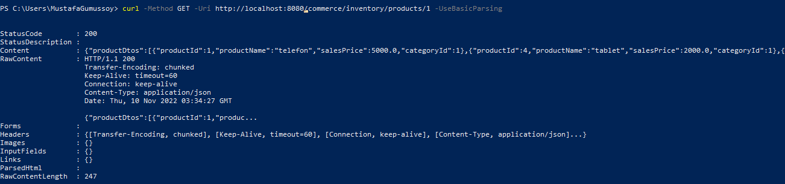
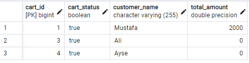

Testlerimi cURL kullanarak yaptım. Paket düzenimi size uygun olarak
yapmaya özen gösterdim. Aşağıdaki görseldeki gibi (derste anlatılan)
paket düzenimi oluşturdum.

Oluşturduğum iki mikroserviste (Inventory, Shopping) de aşağıdaki
görseldeki mimariye uydum. Commerce mikroservisi veri tabanı içermediği
için bu mimarinin veri tabanı kısmı kesilmiş biçimini uyguladım
diyebilirim. Bir de Commerce mikroservisi diğer iki mikroservisten
farklı olarak RestClient içeriyor.

Tüm projenin mimarisi ise derste aşağıdaki görseldeki gibi olması
istendi. Ben de tam olarak o şekilde projeyi gerçekleştirdim.

Oluşturduğum veri tabanlarının en son hâllerinin ER diyagramları şu
şekildedir:

 

Inventory, Shopping ve Commerce olarak sırasıyla mikroservisleri yaptım.
Commerce mikroservisini yapmadan önce product_name özelliği tabloda
yoktu fakat Commerce ile hem Product tablosuna hem Car_Product tablosuna
erişim sağlayabildiğim için Car_Product tablosundaki product_id
özelliğini kullanarak Product tablosundan product_name özelliğini
çekebildim ve bu özelliği Card_Product tablosuna ekledim. İki veri
tabanında da iki tablo arasında OneToMany ilişkisi bulunuyor.

# Inventory Microservice 

## **GET** /inventory/products/{id} 

## Product Table 

## **GET** /inventory/product/{id}

## **GET** /inventory/categories 

## Category Table 

# Shopping Microservice 

## **POST** /shopping/cart/create \> Response: cartId 

## Database View 

## **POST** /shopping/cart/add \< Request: cartProductDto 

## Database View

Bu isteği atarken Commerce mikroservisini yapmamıştım, o yüzden
sales_price değerini elimle girmiştim fakat Commerce mikroservisini
yaptıktan sonra elle girmeden Inventory mikroservisini kullanarak
sales_price değerini bulabiliyorum. Ayrıca daha sonradan product_name
özelliğini de tabloya ekledim.

## **DELETE** /shopping/cart/{cartId}/remove/{productId} 

## Database View (İstekten Önce)

## Database View (İstekten Sonra)

Ben DELETE isteğini tüm CardProduct nesnelerini silmek gibi değil de
sales_quantity özelliğinden bir eksiltmek, eğer sales_quantity sıfır
olursa da tamamen silmek gibi düşündüm, o yüzden o şekilde yerine
getirdim.

## **GET** /shopping/checkout/{cartId} \> Eğer checkout false ise true yap  

## Database View

Cart oluşturma kısmında Mustafa'nın cart_status özelliği false idi,
şimdi ise true.

## **GET** /shopping/cart/find/{cartId} 

Çıktıda da görüldüğü gibi totalAmount değeri kaydedilememiş. Bu çıktıyı
gördükten sonra veri tabanına kayıt kısımlarını bir daha gözden geçirdim
ve yeni bir CardProduct ekleyip yeniden denediğimde yeni eklediğim
miktar totalAmount değerine yansıdı.

2 tane 2000 birimlik ürün ekledim ve sonuç olarak toplam miktar 4000
oldu. İçerikte çıkanlar yanlış bir şekilde veri tabanına kaydedilen
ürünler.

Veri tabanını sıfırlayıp CardProduct ekleyip çıkaralım...

Cart nesneleri haricinde diğer kayıtları sildim ve tanesi 300 birim olan
üründen bir tane ekledim. Mustafa'nın total_amount değeri 300 arttı ve
CardProduct tablosunda bir satır oluştu.

Şimdi eklediğim CardProduct nesnesini silelim...

Sonuç olarak CardProduct tablosu boşaldı ve Mustafa'nın total_amount
değeri 300 azaldı.

# Commerce Microservice 

## **GET** /commerce/inventory/products/{id}  
  
## **GET** /commerce/inventory/product/{id}  

## **GET** /commerce/inventory/categories

## **POST** /commerce/shopping/cart/create > Response: cartId  

## Database View

## **POST** /commerce/shopping/cart/add < Request: cartProductDto

## Database View

Bu sefer sales_quantity ve product_name özelliklerini elimle girmedim.
Servis benim yerime o özellikleri buldu ve doldurdu.

## **DELETE** /commerce/shopping/cart/{cartId}/remove/{productId} 

## Database View

Yukarı görüldüğü gibi tablet ürünün sayısı bir azaldı ve toplam maliyet
2000 birim düştü.

## **GET** /commerce/shopping/checkout/{cartId} \> Eğer checkout false ise true  
  
## Database View (İstekten Önce) 
 
## İstekten Sonra 

## **GET** /commerce/shopping/cart/find/{cartId}  

Yukarıda yapılan işlemlerin sonuçları yukarıdaki görselde Content
kısmında doğrulanıyor.
